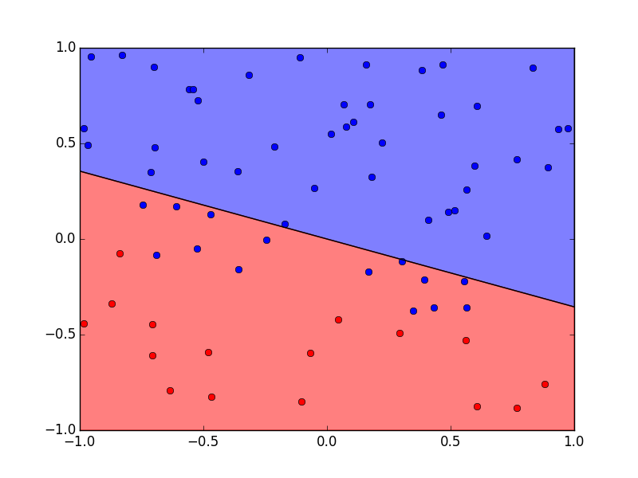

# python-perceptron
I am not a clever namer.

A perceptron is an algorithm that can classify linearly separable data.  It was one of the first machine learning algorithms and dates back to the 1950s.  [Wikipedia](https://en.wikipedia.org/wiki/Perceptron)

It is used as an early example in the [first lecture of a machine learning MOOC](https://youtu.be/mbyG85GZ0PI?t=1398) that I'm watching, so I implemented it in Python.

